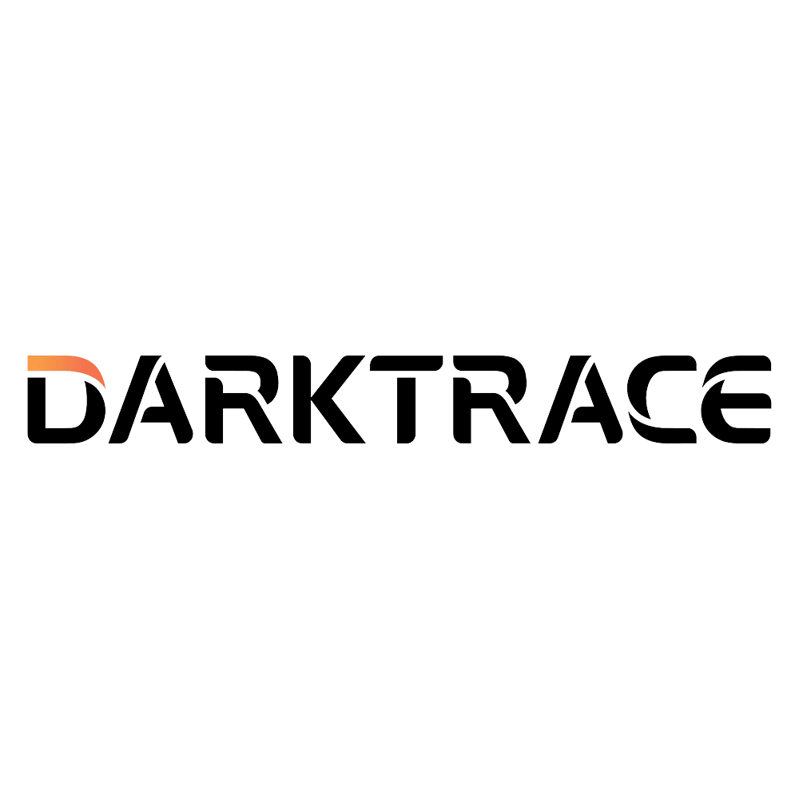
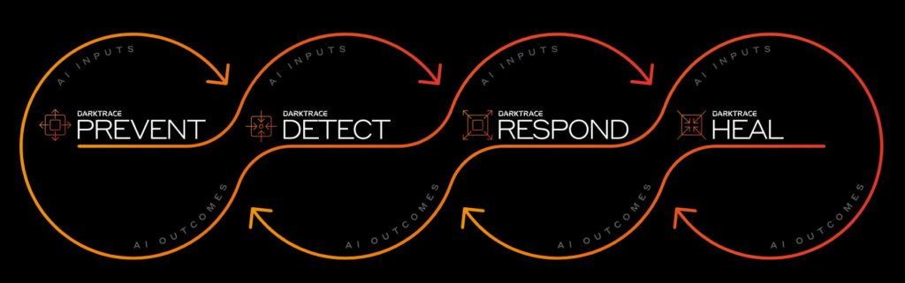

# Manual d'IA en l'àmbit de la informàtica (ASIX)

# Manual d'ús i impacte de Darktrace AI

## Índex
1. Introducció a Darktrace AI  
2. Aplicacions de la IA  
3. Impacte al sector  
4. Impacte ambiental  
5. Propostes per minimitzar els impactes ambientals  

---

## 1. Introducció a Darktrace AI

Darktrace és una eina avançada d’intel·ligència artificial aplicada a la ciberseguretat. Utilitza l’aprenentatge automàtic i l’anàlisi del comportament per detectar i respondre a ciberamenaces en temps real. La seva funcionalitat principal és l’ús d’algoritmes de Machine Learning per comprendre el "comportament normal" d’una xarxa i identificar anomalies que podrien ser indicatives d’activitats malicioses.

---

## 2. Aplicacions de la IA

Les aplicacions de Darktrace en el camp de la ciberseguretat són àmplies i crucials per protegir les xarxes modernes:

- **Autonomous Response amb Antigena**: Darktrace pot implementar accions automàtiques per bloquejar o contenir amenaces sense intervenció humana.  
- **Detecció d'anomalies avançades**: Analitza dades en temps real per identificar comportaments no usuals en dispositius o usuaris.  
- **Protecció d'entorns híbrids**: Funciona en infraestructures locals, al núvol i en sistemes IoT.  
- **Visibilitat total de la xarxa**: Permet veure i comprendre totes les connexions i tràfics dins de la xarxa.  

---

## 3. Impacte al sector

L'ús de Darktrace ha transformat el camp de la ciberseguretat:

- **Detecció proactiva d'amenaces**: Redueix significativament el temps entre el moment en què es detecta una amenaça i el moment en què s’actua sobre ella.  
- **Eficiència operativa**: Permet que els equips de seguretat se centrin en tasques crítiques mentre Darktrace s'encarrega d'aspectes rutinaris i automàtics.  
- **Confiança en la seguretat**: Millora la capacitat d’adaptar-se a amenaces noves i desconegudes, incloent zero-day attacks.  

---

## 4. Impacte ambiental

L’ús de Darktrace també té repercussions ambientals que cal tenir en compte:

- **Consum energètic elevat**: Darktrace requereix servidors i data centers per analitzar grans quantitats de dades, la qual cosa implica un alt consum d’energia.  
- **Dependència d'infraestructures tecnològiques**: Les instal·lacions necessàries poden contribuir a emissions de carboni si no utilitzen fonts d’energia renovable.  

---

## 5. Propostes per minimitzar els impactes ambientals

Per reduir l’impacte ambiental derivat de l’ús de Darktrace, es poden implementar les següents mesures:

1. **Utilitzar data centers verds**: Allotjar Darktrace en infraestructures que utilitzin energia renovable i eficiència energètica.  
2. **Optimització d'algoritmes**: Millorar els models de IA perquè requereixin menys potència computacional.  
3. **Polítiques de gestió energètica**: Configurar Darktrace per reduir operacions redundants i prioritzar anàlisis només en moments crítics.  
4. **Edge Computing**: Emmagatz

